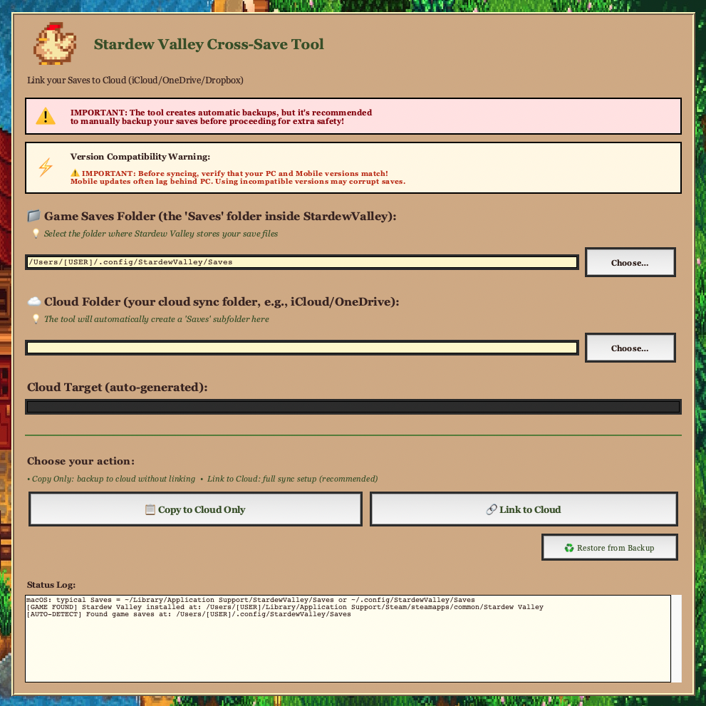

# 🐔 Stardew Valley Cross-Save Tool

A cross-platform GUI tool to sync your Stardew Valley save files across multiple devices using cloud storage (iCloud, OneDrive, Dropbox, etc.).



## 📋 Features

-   **Cross-Platform Support**: Works on macOS, Windows, and Linux
-   **Cloud Sync**: Automatically sync saves using your preferred cloud storage
-   **Automatic Backups**: Creates backup copies before any operation
-   **Symlink/Junction Management**: Uses native OS linking (symlinks on macOS/Linux, junctions on Windows)
-   **User-Friendly GUI**: Themed interface with Stardew Valley colors and graphics
-   **Safe Operations**: Migrates existing saves to cloud before creating links
-   **Auto-Detection**: Automatically finds game installation and saves folder
-   **Version Compatibility Warnings**: Alerts about PC/Mobile version compatibility requirements
-   **GitHub Actions CI/CD**: Automated multi-platform builds on every release

## 🎮 How It Works

The tool creates a symbolic link (or junction on Windows) from your local Stardew Valley saves folder to a folder inside your cloud storage. This way:

1. Stardew Valley continues to read/write saves from its original location
2. The saves are actually stored in your cloud folder
3. Cloud storage automatically syncs saves across all your devices
4. You can play on different computers and continue where you left off

### Visual Diagram

```
┌─────────────────────────────────────────────────────────────────────────┐
│                      DESKTOP (Windows/Mac/Linux)                        │
│                         ✅ AUTOMATIC SYNC                               │
│  ┌──────────────────┐         ┌─────────────────────────────┐           │
│  │  Stardew Valley  │         │   Game Saves Folder         │           │
│  │      Game        │◄────────┤   (Symlink/Junction)        │           │
│  │                  │ reads/  │                             │           │
│  │  🎮 Playing...   │ writes  │   ~/StardewValley/Saves ────│┐          │
│  └──────────────────┘         └─────────────────────────────┘│          │
│                                            ▲                 │          │
│                                            │                 │          │
│                                            │ (symlink points │          │
│                                            │  to cloud)      │          │
│                                            ▼                 │          │
│                               ┌────────────────────────────┐ │          │
│                               │   Cloud Storage Folder     │ │          │
│                               │                            │ │          │
│                               │  📁 iCloud/OneDrive/       │ │          │
│                               │     Dropbox/Saves/         │◄┘          │
│                               │                            │            │
│                               │  ├─ Farm1_123456/          │            │
│                               │  ├─ Farm2_789012/          │            │
│                               │  └─ SaveGameInfo           │            │
│                               └────────────────────────────┘            │
│                                            │                            │
└────────────────────────────────────────────┼────────────────────────────┘
                                             │
                                             │ ☁️  Automatic Sync
                                             │
                    ┌────────────────────────┼────────────────────────┐
                    │                        │                        │
                    ▼                        ▼                        │
    ┌───────────────────────────┐  ┌───────────────────────────┐      │
    │   LAPTOP / OTHER PC       │  │   ANOTHER DESKTOP         │      │
    │   ✅ AUTO SYNC            │  │   ✅ AUTO SYNC            │      │
    │  ┌─────────────────────┐  │  │  ┌─────────────────────┐  │      │
    │  │  Cloud Saves/  ◄────┼──┼──┼──┤  Cloud Saves/       │  │      │
    │  │  (same files)       │  │  │  │  (same files)       │  │      │
    │  └─────────────────────┘  │  │  └─────────────────────┘  │      │
    │           ▲               │  │           ▲               │      │
    │           │ symlink       │  │           │ symlink       │      │
    │           ▼               │  │           ▼               │      │
    │  ┌─────────────────────┐  │  │  ┌─────────────────────┐  │      │
    │  │  Stardew Valley     │  │  │  │  Stardew Valley     │  │      │
    │  │  🎮 Continue play   │  │  │  │  🎮 Same progress!  │  │      │
    │  └─────────────────────┘  │  │  └─────────────────────┘  │      │
    └───────────────────────────┘  └───────────────────────────┘      │
                                                                      │
                                                                      │
                                                                      ▼
                                           ┌──────────────────────────────────┐
                                           │   MOBILE (iOS/Android)           │
                                           │   ⚠️  MANUAL TRANSFER ONLY       │
                                           │                                  │
                                           │  ┌────────────────────────────┐  │
                                           │  │  ☁️ Same Cloud Folder      │◄─┼─┐
                                           │  │  (iCloud/OneDrive/Dropbox) │  │ │
                                           │  │  Saves/                    │  │ │
                                           │  └────────────────────────────┘  │ │
                                           │              ▲                   │ │
                                           │              │                   │ │
                                           │              ├──► 📲 WIRELESS!   │ │
                                           │              │    Copy files     │ │
                                           │              │    via cloud app  │ │
                                           │              ▼                   │ │
                                           │  ┌────────────────────────────┐  │ │
                                           │  │  Local Saves Folder        │  │ │
                                           │  └────────────────────────────┘  │ │
                                           │              │                   │ │
                                           │              │ Game reads/writes │ │
                                           │              │ directly here     │ │
                                           │              ▼                   │ │
                                           │  ┌────────────────────────────┐  │ │
                                           │  │  Stardew Valley (Mobile)   │  │ │
                                           │  │  📱 Playing on phone...    │  │ │
                                           │  └────────────────────────────┘  │ │
                                           └──────────────────────────────────┘ │
                                                                                │
                    ┌───────────────────────────────────────────────────────────┘
                    │ Same cloud folder used by desktop!
                    └─ You manually copy: Cloud ↔️ Local Saves (wirelessly via app)

    ┌──────────────────────────────────────────────────────────────────────┐
    │ 🚫 NINTENDO SWITCH / SWITCH 2                                        │
    │    NOT SUPPORTED - Save files cannot be accessed externally          │
    │    Nintendo's closed system prevents any save file transfer          │
    └──────────────────────────────────────────────────────────────────────┘

    ✨ Desktop: Automatic sync via cloud! ✨
    📱 Mobile: Manual copy, but WIRELESS via same cloud folder (no cables!)
    🚫 Switch: Not possible - hardware limitation
```

**Key Benefits:**
- 🔗 **Transparent**: Game doesn't know saves are in the cloud
- ☁️ **Automatic**: Cloud service handles all syncing (PC/Mac/Linux only)
- 🔄 **Real-time**: Changes sync as you play on desktop
- 🛡️ **Safe**: Original saves backed up before linking
- 📱 **Mobile-friendly**: Access same cloud folder wirelessly via cloud app

**Important Notes:**
- 📱 **Mobile (iOS/Android)**: Manual copy required (symlinks not supported on mobile), BUT you still use the same cloud folder - just copy files wirelessly via iCloud/OneDrive/Dropbox app instead of cables!
- 🎮 **Nintendo Switch**: Not supported - save files cannot be accessed externally

## 💻 System Requirements

-   **Python 3.x** (3.8 or higher recommended)
-   **Operating System**: macOS, Windows, or Linux
-   **Cloud Storage**: iCloud, OneDrive, Dropbox, Google Drive, or any synced folder

### Python Dependencies

-   `tkinter` (usually included with Python)
-   `Pillow` (for image handling)

## 🚀 Installation

### Option 1: Download Pre-Built Application (Recommended)

Pre-built binaries are automatically generated for all platforms via GitHub Actions.

**macOS:**

1. Download `StardewCrossSave-macOS.zip` from [Releases](../../releases)
2. Extract and run the `.pkg` installer
3. Find the app in your Applications folder

**Windows:**

1. Download `StardewCrossSave-Windows.zip` from [Releases](../../releases)
2. Extract the folder
3. Run `Stardew Valley Cross-Save Tool.exe`

**Linux:**

1. Download `StardewCrossSave-Linux.zip` from [Releases](../../releases)
2. Extract the ZIP file
3. Make the file executable: `chmod +x "Stardew Valley Cross-Save Tool"`
4. Run from terminal: `./Stardew\ Valley\ Cross-Save\ Tool`

> **Note**: The Linux executable has no file extension - this is normal! It's a compiled binary file. Don't open it with a text editor (you'll see binary/machine code). Instead, run it from the terminal as shown above.

### Option 2: Run from Source

```bash
# Clone the repository
git clone <repository-url>
cd "Symlinking Tool"

# Install dependencies
pip3 install pillow

# Run the application
python3 app.py
```

## ⚠️ Important: Version Compatibility & Platform Limitations

### Version Compatibility

**Before syncing saves between PC and Mobile:**

-   PC (Steam) and Mobile versions MUST match
-   Mobile updates often lag behind PC updates
-   Using incompatible versions may corrupt your saves
-   The tool displays a warning banner about this
-   Always verify version compatibility before syncing!

### Platform Support & Limitations

✅ **Fully Supported (Automatic Sync):**
-   **Windows** (Steam, GOG)
-   **macOS** (Steam, GOG, App Store)
-   **Linux** (Steam, Flatpak)

⚠️ **Partially Supported (Manual Transfer Required):**
-   **iOS/Android Mobile**: The tool works on PC/Mac/Linux only. For mobile devices:
    -   Symlinks are not supported on mobile platforms
    -   You must manually copy save files to/from your mobile device
    -   **BUT**: You still use the SAME cloud folder! No cables needed - copy wirelessly via:
        -   iCloud app (iOS/macOS)
        -   OneDrive app (iOS/Android)
        -   Dropbox app (iOS/Android)
        -   Or any cloud service file manager app
    -   This is still much easier than traditional USB cable transfer!
    -   Be extra careful with version compatibility!

❌ **Not Supported:**
-   **Nintendo Switch / Switch 2**: Cloud save syncing is NOT possible
    -   Nintendo's closed ecosystem prevents external save file access
    -   Switch saves are locked to the console
    -   No workaround available - this is a hardware/software limitation

**The tool will:**

-   Detect if Stardew Valley is installed on your PC/Mac/Linux
-   Show a warning if game is not found
-   Alert you to manually verify version compatibility
-   Only create symlinks/junctions on supported desktop platforms

## 📖 Usage

### First Time Setup

1. **Launch the application**
2. **Select Game Saves Folder**

    - Click "Choose…" next to "Game Saves Folder"
    - Navigate to your Stardew Valley saves location:
        - **macOS**: `~/Library/Application Support/StardewValley/Saves` or `~/.config/StardewValley/Saves`
        - **Windows**: `%AppData%\StardewValley\Saves`
        - **Linux**: `~/.config/StardewValley/Saves`

3. **Select Cloud Folder**

    - Click "Choose…" next to "Cloud Folder"
    - Select your cloud storage folder (e.g., `~/iCloud`, `~/OneDrive`, `~/Dropbox`)

4. **Create the Link**

    - Click "2️⃣ Link Saves → Cloud"
    - The tool will:
        - Create a backup of your current saves
        - Copy saves to the cloud folder
        - Create a symlink/junction from the game folder to the cloud

5. **Done!** Your saves are now synced via cloud storage

### Operations

-   **1️⃣ Migrate to Cloud**: Copy local saves to cloud (without creating link)
-   **2️⃣ Link Saves → Cloud**: Full setup - backup, migrate, and create symlink
-   **♻️ Restore Backup**: Restore the last backup and remove the link

### Important Notes

⚠️ **Always backup your saves manually before using this tool**

-   The tool creates automatic backups in `~/StardewValleyCrossSaves_Backups`
-   Only one backup is kept in memory (the most recent one)
-   Older backups must be restored manually if needed

## 🛠️ Building from Source

### Automated Builds (GitHub Actions)

The project uses GitHub Actions to automatically build binaries for all platforms:

1. Create a new tag: `git tag v1.0.0 && git push origin v1.0.0`
2. GitHub Actions automatically builds Windows, macOS, and Linux versions
3. Binaries are uploaded to the GitHub Release

See [`.github/workflows/build.yml`](.github/workflows/build.yml) for workflow details.

### Manual Builds

#### macOS

```bash
chmod +x build_macos.sh
./build_macos.sh
```

Creates:

-   `dist/Stardew Valley Cross-Save Tool.app` (application bundle)
-   `Stardew Valley Cross-Save Tool.pkg` (installer package)

Features:

-   Automatic permission fixes for clean builds
-   PyInstaller with proper macOS bundle structure
-   Code signing and notarization ready

#### Windows

```bat
build_windows.bat
```

Creates:

-   `dist/Stardew Valley Cross-Save Tool/Stardew Valley Cross-Save Tool.exe`

Features:

-   Automatic attribute clearing for clean builds
-   Handles read-only files from previous builds
-   For professional installer, use [Inno Setup](https://jrsoftware.org/isinfo.php)

#### Linux

```bash
chmod +x build_linux.sh
./build_linux.sh
```

Creates:

-   `dist/Stardew Valley Cross-Save Tool` (standalone executable)

Features:

-   Single-file executable with `--onefile`
-   Automatic permission management
-   AppImage creation instructions included

## 📁 Project Structure

```
Stardew Valley Cross-Save Tool/
├── app.py                          # Main application (with design patterns)
├── ARCHITECTURE.md                 # Architecture & design patterns doc
├── build_macos.sh                  # macOS build script
├── build_windows.bat               # Windows build script
├── build_linux.sh                  # Linux build script
├── assets/
│   ├── logo.png                    # Application logo (PNG)
│   ├── logo.icns                   # macOS icon
│   ├── logo.ico                    # Windows icon
│   └── background.jpg              # UI background image
├── test/                           # Test folders
│   ├── cloud/Saves/
│   └── original/Saves/
├── .github/
│   ├── workflows/
│   │   └── build.yml               # GitHub Actions build workflow
│   └── copilot-instructions.md     # AI/Copilot guidelines
├── .gitignore
└── README.md
```

## 🎨 Technology Stack

-   **Language**: Python 3.x
-   **GUI Framework**: Tkinter
-   **Image Processing**: Pillow (PIL)
-   **Build Tool**: PyInstaller
-   **Platform Detection**: Platform-specific symlink/junction handling

## 🏗️ Architecture

The application is built with **professional software engineering principles**: **SOLID**, **DRY (Don't Repeat Yourself)**, **KISS (Keep It Simple, Stupid)**, and implements proven **Design Patterns** from the Gang of Four:

### Design Patterns Used

-   **Singleton Pattern**: Configuration management (colors, fonts, paths)
-   **Strategy Pattern**: Platform-specific operations (symlinks vs junctions)
-   **Factory Pattern**: Consistent widget creation and platform detection
-   **Command Pattern**: Undoable operations (migrate, link, restore)
-   **Facade Pattern**: Simplified file operations interface
-   **Template Method**: Structured UI building

### SOLID Principles

-   **S** - Single Responsibility: Each class has one focused purpose
-   **O** - Open/Closed: Extensible without modification
-   **L** - Liskov Substitution: Strategies are interchangeable
-   **I** - Interface Segregation: Small, focused interfaces
-   **D** - Dependency Inversion: Depends on abstractions, not implementations

### Key Components

```
Config (Singleton)           → Application configuration
LinkStrategy (Strategy)      → Platform-specific link operations
PlatformFactory (Factory)    → Creates platform strategies
WidgetFactory (Factory)      → Creates styled UI components
FileOperations (Facade)      → Simplified file operations
Command Pattern              → MigrateCommand, LinkCommand, RestoreCommand
GameDetectionService         → Auto-detect game installation
StardewCrossSaveApp          → Main UI coordinator
```

📚 For detailed architecture documentation, see [ARCHITECTURE.md](ARCHITECTURE.md)

## 🤝 Contributing

Contributions are welcome! Please:

1. Fork the repository
2. Create a feature branch (`git checkout -b feature/amazing-feature`)
3. Commit your changes (`git commit -m 'Add amazing feature'`)
4. Push to the branch (`git push origin feature/amazing-feature`)
5. Open a Pull Request

## 📝 License

This project is open source and available under the MIT License.

## ⚠️ Disclaimer

This tool is not affiliated with or endorsed by ConcernedApe or Stardew Valley. Use at your own risk. Always maintain backups of your save files.

## 🐛 Troubleshooting

### "The game Saves folder appears to already be a link/junction"

This means a link already exists. Use "♻️ Restore Backup" first to remove it, then try again.

### Saves not syncing

1. Verify your cloud storage is actively syncing
2. Check that the cloud folder path is correct
3. Ensure you have write permissions to both folders

### Permission denied on macOS

macOS may require explicit permissions. Grant Full Disk Access:

1. System Preferences → Security & Privacy → Privacy
2. Select "Full Disk Access"
3. Add Python or the Terminal app

## 💬 Support

For issues, questions, or suggestions:

-   Open an [Issue](../../issues)
-   Check existing issues for solutions

---

Made with ❤️ for the Stardew Valley community
